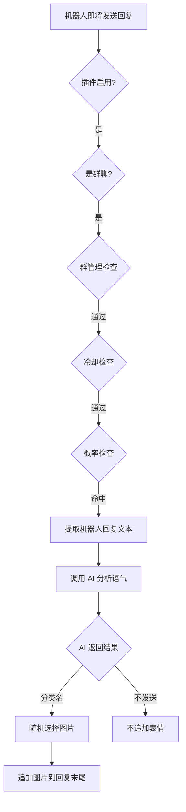

# 🎭 AI智能表情包

AstrBot 插件 —— 机器人回复消息时自动根据自身语气搭配表情包。

机器人在群聊中回复消息时，自动分析自身回复的语气和情绪，调用 AI 判断最合适的表情包分类，从对应分类中随机选择图片追加到回复末尾。

## ✨ 功能特性

- 🤖 **AI 语气分析**：机器人回复时自动分析自身回复的语气，智能搭配表情包
- 📁 **自动扫描分类**：启动时自动扫描 `images/` 目录，自动识别所有子目录为表情分类
- 🎲 **随机发送**：从对应分类目录中随机选择图片追加到回复末尾，避免重复
- ⚙️ **WebUI 配置**：支持在 AstrBot WebUI 中配置所有参数
- 📊 **分类描述系统**：每个分类支持自定义描述，帮助 AI 准确理解分类用途
- 🎯 **触发概率**：支持 0-100% 的触发概率配置
- ⏱️ **冷却时间**：支持自定义冷却时间，避免刷屏
- 👥 **群管理**：支持群白名单/黑名单模式
- 🖼️ **多格式支持**：支持 jpg、jpeg、png、webp、gif 格式
- 🐳 **跨平台**：兼容 Windows、Linux、Docker 部署

## 📁 目录结构

```
astrbot_plugin_ai_sticker/
├── main.py                    # 插件主程序
├── metadata.yaml              # 插件元数据
├── _conf_schema.json          # 配置 Schema
├── requirements.txt           # 依赖声明
├── README.md                  # 本文件
├── images/                    # 表情包图片目录
│   ├── 开心/                  # 开心分类（4张示例图片）
│   │   ├── 001.png
│   │   ├── 002.png
│   │   ├── 003.png
│   │   └── 004.png
│   ├── 生气/
│   ├── 搞笑/
│   ├── 震惊/
│   ├── 无语/
│   └── 点赞/
└── pages/                     # WebUI 配置页面
    └── console/
        ├── index.html
        ├── app.js
        └── style.css
```

## 🚀 快速开始

### 1. 安装插件

将插件目录放置到 AstrBot 的 `data/plugins/` 目录下：

```bash
cd AstrBot/data/plugins
git clone https://github.com/your/astrbot_plugin_ai_sticker
```

或在 AstrBot WebUI 插件市场中搜索安装。

### 2. 添加表情包图片

在 `images/` 目录下创建分类文件夹，放入表情包图片：

```
images/
├── 开心/
│   ├── happy_01.webp
│   └── happy_02.gif
├── 狗头/
│   ├── dog_01.png
│   └── dog_02.jpg
└── 吃瓜/
    └── melon_01.webp
```

> 📌 新增分类或图片后，在 WebUI 管理面板点击「重新扫描图片目录」即可生效，无需修改代码或重启。

### 3. 启用插件

在 AstrBot WebUI 的「插件管理」中找到「AI智能表情包」，点击启用。

### 4. 配置参数

在 WebUI 中点击插件卡片进入详情页，打开「管理面板」Page：

- **分类描述**：编辑每个分类的描述文字
- **AI 提示词**：自定义 AI 分类提示词模板
- **触发概率**：设置 0-100% 的触发概率
- **冷却时间**：设置两次发送的最小间隔
- **群白名单/黑名单**：控制生效的群聊

或者直接在 WebUI 的插件配置页面修改参数。

## ⚙️ 配置项说明

| 配置项 | 类型 | 默认值 | 说明 |
|--------|------|--------|------|
| `enable` | bool | true | 是否启用插件 |
| `trigger_probability` | int | 30 | 触发概率 (0-100) |
| `cooldown_seconds` | int | 60 | 冷却时间 (秒) |
| `use_whitelist` | bool | false | 启用群白名单模式 |
| `group_whitelist` | list | [] | 群白名单列表 |
| `group_blacklist` | list | [] | 群黑名单列表 |
| `category_descriptions` | text(JSON) | 见默认值 | 分类描述 (JSON格式) |
| `ai_prompt_template` | text | 见默认值 | AI 提示词模板 |

## 🎯 工作原理



## 🛠️ 管理指令

| 指令 | 权限 | 说明 |
|------|------|------|
| `/ai_sticker_reload` | 管理员 | 重新扫描图片目录 |

## 📋 依赖

本插件仅使用 AstrBot 内置 API 和 Python 标准库，无需额外安装依赖。

## 🔧 兼容性

- **AstrBot 版本**：≥ v4.16
- **平台**：Windows / Linux / Docker
- **消息平台**：所有 AstrBot 支持的消息平台（QQ、Telegram、微信、飞书、钉钉等）

## 📄 许可证

MIT License

## 🙏 致谢

- [AstrBot](https://github.com/AstrBotDevs/AstrBot) - 强大的聊天机器人框架
- 所有为本项目贡献表情包的用户
